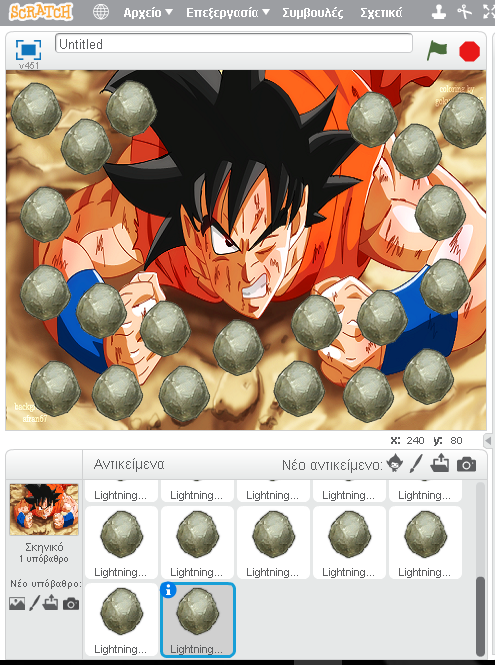

#Scratch Video Game
Τριαντάφυλλος Καραδήμος
ΑΜ Π2015017

##Παραδοτέο 0 

https://github.com/p15kara/pibookgr/tree/gh-pages/_quotes
...
##Παραδοτέο 1 

Επιλογή Θέματος: Scratch Παιχνίδι

##Παραδοτέο 2

Η εργασία θα απευθύνεται σε παιδιά μέχρι τρίτης δημοτικού. Σκοπός της θα είναι η κατανόηση και εξάσκηση στις αριθμητικές πράξεις ( πρόσθεση, αφαίρεση, διαίρεση, πολλαπλασιασμός). 
  Ουσιαστικά σταδιακά θα εξελίσσεται μία ιστορία παρμένη από το παιδικό ”DragonBall”. Στην συγκεκριμένη ιστορία, ο ήρωας της σειράς Goku βρίσκεται αντιμέτωπος με την εξωγήινη αντίπαλο του Freezer η οποία σκοπεύει να κατακτήσει και να υποδουλώσει τον πλανήτη γη. Ο Goku με τις δυνάμεις που έχει αρχικά, του είναι αδύνατον να νικήσει και έτσι η freezer τον πετάει στα βράχια, με αποτέλεσμα να καλύπτεται από πέτρες. Σκοπός του Goku είναι να καταφέρει να διώξει  τις πέτρες από πάνω του ώστε να σηκωθεί και οργισμένος από το κακό που σκέφτεται να κάνει η Freezer προς τον πλανήτη Γη, να εξελιχθεί σε Super-Sayian (πράγμα το οποίο θα του δεκαπλασιάσει τις δυνάμεις και θα καταφέρει να την νικήσει).

  Το παιχνίδι:

  Το παιχνίδι θα ξεκινάει δείχνοντας σε βίντεο το σημείο της μάχης, όπου η Freezer ρίχνει τον Goku στο πάτωμα. Έπειτα αλλάζει η σκηνή και ο Goku είναι καλυμμένος με πέτρες.
Η κάθε μία πέτρα θα έχει σχεδιασμένο έναν αριθμό και το σύμβολο πράξης ή τον δεύτερο αριθμό που χρειάζεται η πράξη ή το αποτέλεσμα αυτής. Ο χρήστης θα πρέπει να επιλέξει την πέτρα με τον αριθμό και το σύμβολο της πράξης μαζί με τον αντίστοιχο δεύτερο αριθμό και μαζί με το αντίστοιχο αποτέλεσμα. Τα αποτελέσματα που ο χρήστης βρίσκει σωστά (δηλαδή οι πέτρες από τις οποίες προκύπτουν) αυτομάτως θα βγαίνουν εκτός λειτουργίας. Μόλις ο χρήστης τελειώνει με την μία πράξη θα ακολουθάει η ίδια διαδικασία στην επόμενη. Με το που ο χρήστης βγάλει εις πέρας και τις τέσσερις πράξεις θα παίζει το βίντεο όπου τελικά ο Goku εξελίσσεται σε super saian και νικάει την Freezer, σώζοντας τον πλανήτη.

##Παραδοτέο 3

...

##Παραδοτέο 4

...

##Tελική Αναφορά

...
